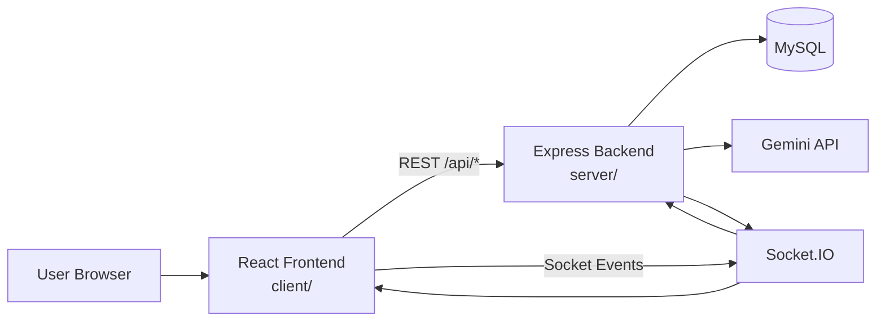
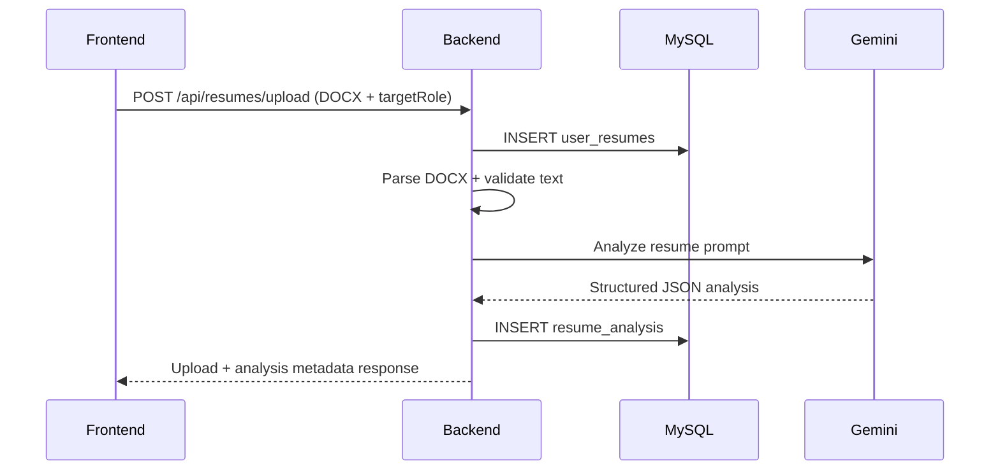
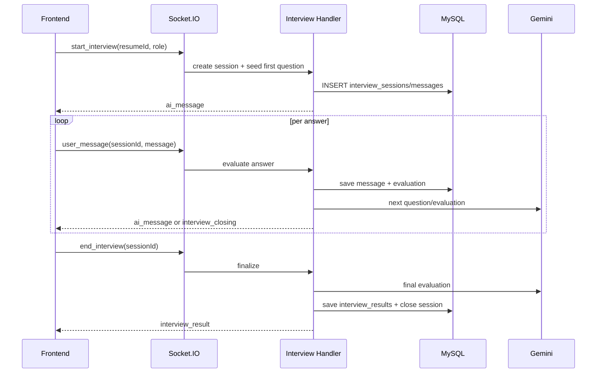

# Architecture

## System Design
SkillWise uses a **modular monolith** architecture:
- One backend service (`Node.js + Express`) handles auth, resume analysis, skills, and interview history.
- One frontend SPA (`React + Vite`) handles UI, routing state, and API/socket communication.
- One relational database (`MySQL`) stores users, profiles, resumes, analysis, and interview sessions.
- One real-time channel (`Socket.IO`) supports live mock interview flows.

This is not a microservices architecture today. Boundaries are separated by folders/modules instead of separate deployable services.

## High-Level Interaction

## Frontend -> Backend -> DB Flow
### Resume analysis flow

### Live interview flow

## Internal Module Boundaries
- `server/src/routes/*`: HTTP route registration and middleware binding
- `server/src/controllers/*`: request orchestration and response shaping
- `server/src/models/*`: SQL/database access
- `server/src/utils/*`: parser/validator/AI helpers
- `server/src/handlers/interviewHandler.js`: socket event orchestration

## Communication Details
- REST for CRUD/data retrieval (`/api/auth`, `/api/resumes`, `/api/skills`, `/api/interviews`, `/api/interviewee`)
- Socket.IO for low-latency interview chat and evaluation events
- JWT bearer tokens for protected REST routes; token + user context for socket handshake

## Why this architecture
- Faster development and easier debugging for a student/mini-project scope
- Clear module boundaries without multi-service deployment overhead
- Supports both request-response and real-time workflows in one backend process