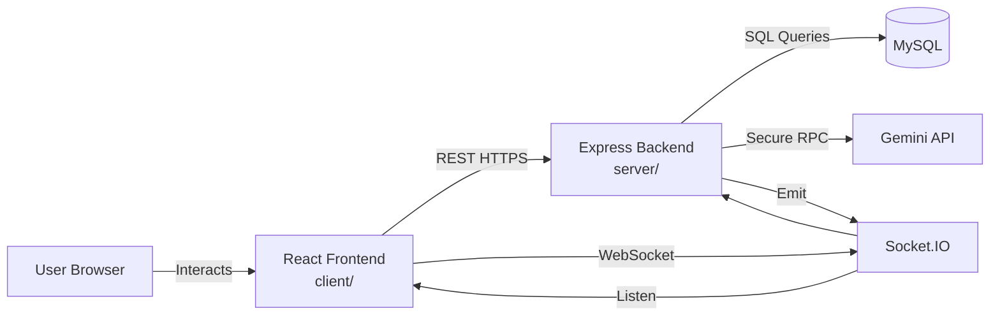
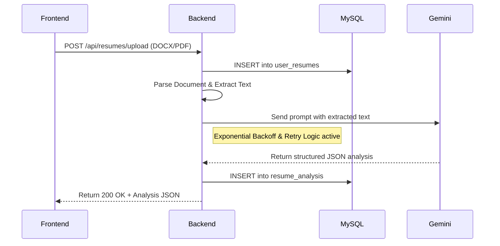
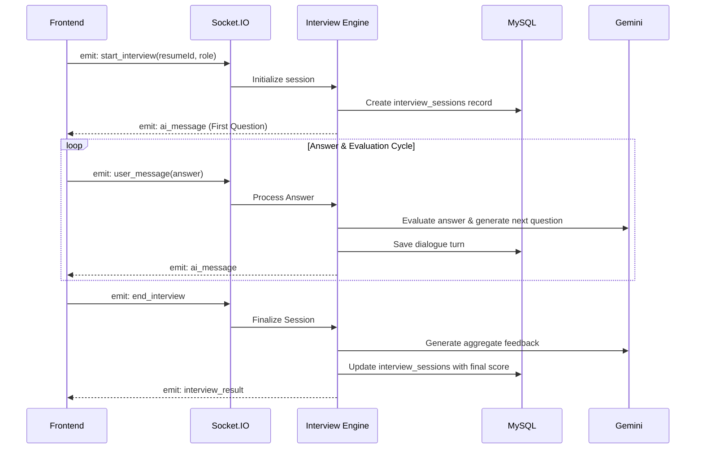

# System Architecture

SkillWise utilizes a **Modular Monolith** architectural pattern. This design provides the simplicity of a single deployable unit while maintaining strict internal boundaries for future scalability.

## High-Level Topology

- **Frontend Application**: A Single Page Application (SPA) built with React and Vite. It handles client-side routing, local state management, and visual representation.
- **Backend Service**: A Node.js + Express server. It manages REST API routes, Socket.IO connections, business logic, and acts as the secure intermediary for external APIs.
- **Relational Database**: A MySQL instance storing user identities, session data, resume metadata, and historical analysis.
- **AI Engine Integration**: Google's Gemini API, invoked securely from the backend to process natural language tasks.

## Data Flow Diagram

## Core Interaction Flows

### 1. The Resume Analysis Pipeline
When a user uploads a resume, the data follows a linear, synchronous flow:

### 2. The Real-Time Mock Interview Loop
Mock interviews require stateful, bidirectional communication. We use WebSockets (via Socket.IO) to achieve sub-second latency.

## Architectural Resilience & Security

SkillWise is designed to fail gracefully and recover automatically:

- **AI Fault Tolerance**: The `geminiService` implements an exponential backoff algorithm. If Google's API returns a `429 Too Many Requests`, the backend pauses and retries automatically before falling back to a secondary API key.
- **Database Connection Pooling**: The MySQL connection utilizes a managed pool with a strict `connectTimeout` to prevent the Node.js event loop from hanging during database outages.
- **Application Hardening**:
  - `helmet`: Injects critical HTTP security headers.
  - `express-rate-limit`: Prevents brute-force attacks on Auth routes and stops abuse of expensive AI endpoints.
- **Graceful Shutdown**: Upon receiving `SIGTERM` (during a deploy or scale event), the server stops accepting new connections and explicitly drains the database pool before exiting.

---
[⬅ Previous Page: Getting Started](getting-started.md) | [🏠 Documentation Index](README.md) | [Next Page: Tech Stack ➡](tech-stack.md)