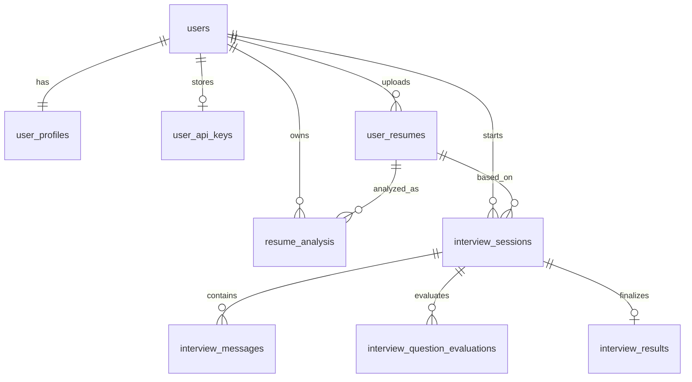

# Database Architecture

SkillWise relies on a **MySQL** relational database to persist user identities, handle structured relational tracking (like interview history), and store semi-structured JSON payloads from our AI engine.

The primary declarative schema and seed data can be found in `dbQueries.sql`.

## Schema Overview & Relationships

SkillWise mixes strict normalization for identity and history with flexible JSON columns for AI analysis. This hybrid approach allows the frontend to rapidly iterate on AI prompts without requiring constant database migrations.

## Core Tables

### Identity & Profiles
- **`users`**: Secure identity table. Stores `email`, bcrypt-hashed `password`, and a `role` enum (`user`, `admin`) to govern dashboard access.
- **`user_profiles`**: Tracks aggregated user skills and career trajectories via a flexible `profile_data` JSON column.
- **`user_api_keys`**: Encrypted storage for Bring-Your-Own-Key (BYOK) functionality. Allows users to exceed their free daily AI limits safely.

### Document Management
- **`user_resumes`**: Metadata about uploaded resumes (file path pointing to Supabase Cloud Storage, type, upload date).
- **`resume_analysis`**: Stores the raw JSON output from the Gemini API after a resume is parsed, mapped back to the specific resume and user. Rows in this table are counted to enforce the daily 1-resume free limit.

### Interview Engine
- **`interview_sessions`**: The core state machine for a mock interview. Tracks active vs. completed status, max question counts, and duration. Rows with `total_questions > 0` are counted to enforce the daily 1-interview free limit.
- **`interview_messages`**: The line-by-line dialogue history (User vs. AI) tied to a session.
- **`interview_question_evaluations`**: The granular, per-question feedback generated by Gemini (technical score, communication score, confidence).
- **`interview_results`**: The final aggregate verdict (`STRONG_HIRE`, `NO_HIRE`) and overall scoring metrics once a session is finalized.

## Connection & Resilience

The backend interacts with MySQL using the `mysql2` driver via a managed connection pool (`server/src/config/db.js`).

### Connection Pool Configuration
To guarantee production stability, the pool is configured with strict limits:
- **`connectionLimit`: 10** — Prevents the Node process from overwhelming the database with concurrent connections during traffic spikes.
- **`connectTimeout`: 10000ms** — Prevents the Express event loop from permanently hanging if the database instance becomes temporarily unreachable or experiences cold-start latency.

### Graceful Teardown
During deployments or crashes, `server/index.js` intercepts `SIGTERM` and `SIGINT` signals. It ensures that `db.end()` is awaited, gracefully draining the pool and preventing corrupted transactions or dangling connections.

---
[⬅ Previous Page: Tech Stack](tech-stack.md) | [🏠 Documentation Index](README.md) | [Next Page: Backend Infrastructure ➡](backend.md)