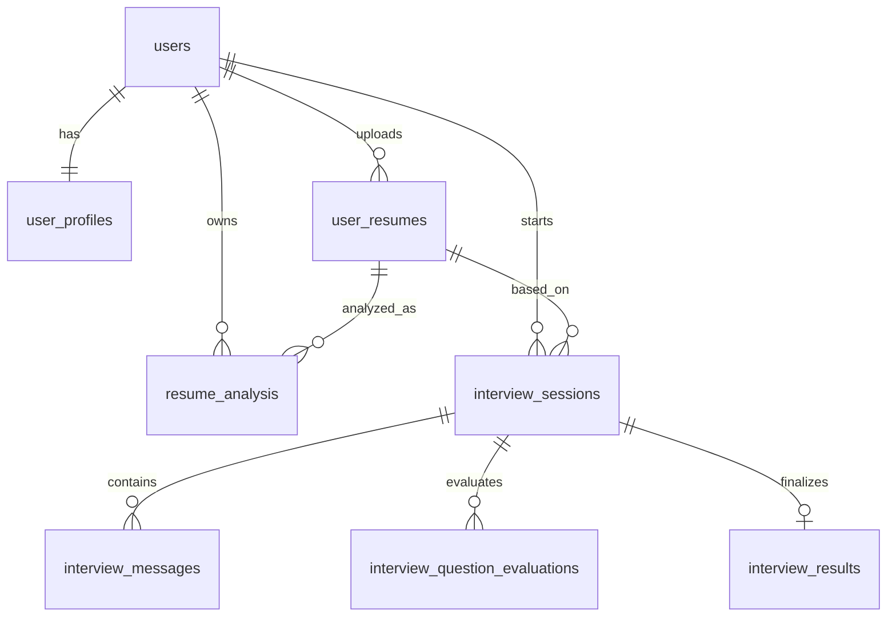

# Database

Database engine: **MySQL**
Primary schema file: `dbQueries.sql`

## Schema Overview
Core tables:
- `users`
- `user_profiles`
- `user_resumes`
- `resume_analysis`
- `interview_sessions`
- `interview_messages`
- `interview_question_evaluations`
- `interview_results`

## Table Details
### `users`
- `id` (PK)
- `name`
- `email` (unique)
- `password` (bcrypt hash)
- `created_at`

### `user_profiles`
- `user_id` (PK, FK -> `users.id`)
- `profile_data` (JSON)
- `updated_at`

### `user_resumes`
- `id` (PK)
- `user_id` (FK -> `users.id`)
- `file_name`
- `file_path`
- `file_type`
- `uploaded_at`

### `resume_analysis`
- `id` (PK)
- `resume_id` (FK -> `user_resumes.id`)
- `user_id` (FK -> `users.id`)
- `analysis_data` (JSON)
- `analyzed_at`

### `interview_sessions`
- `id` (PK)
- `user_id` (FK -> `users.id`)
- `resume_id` (FK -> `user_resumes.id`)
- `role`
- `total_questions`, `max_questions`
- `weak_answer_count`
- `status` (`active|completed`)
- `started_at`, `ended_at`

### `interview_messages`
- `id` (PK)
- `session_id` (FK -> `interview_sessions.id`)
- `sender` (`ai|user`)
- `message`
- `created_at`

### `interview_question_evaluations`
- `id` (PK)
- `session_id` (FK -> `interview_sessions.id`)
- `question`, `answer`
- `question_type`, `difficulty`
- `score`, `rating`, `confidence`
- `technical_score`, `communication_score`, `problem_solving_score`
- `feedback`
- `created_at`

### `interview_results`
- `id` (PK)
- `session_id` (FK -> `interview_sessions.id`)
- `overall_score`
- `verdict` (`STRONG_HIRE|HIRE|LEANING_NO|NO_HIRE`)
- `result_data` (JSON)
- `created_at`

## Relationships

## Important Queries (Used in Code)
### Interview list with sorting
- Used by `server/src/routes/interviewHistoryRoutes.js`
- Joins sessions and final results, supports pagination and sort by date or score.

### Interview session detail
- Fetches one session + evaluations + parsed `result_data` for deep analysis view.

### Latest analysis sync for skills
- Skills mutation routes update `user_profiles.profile_data` and latest `resume_analysis.analysis_data`.

### Resume list and per-resume analysis
- Resume routes read from `user_resumes` and `resume_analysis` with ownership checks.

## Notes
- JSON columns are heavily used to keep analysis payloads flexible.
- App currently mixes normalized relational data and denormalized JSON snapshots.
- Consider future indexing on frequently queried session/date/score columns for scale.